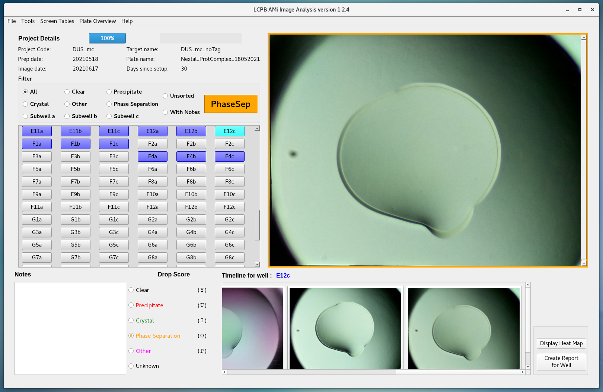
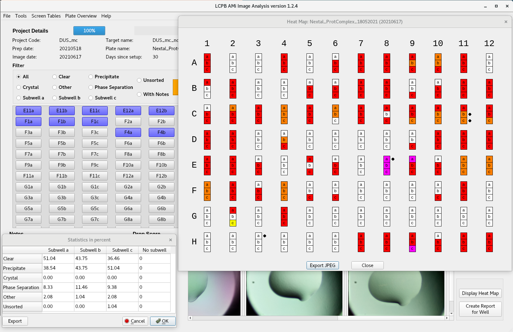
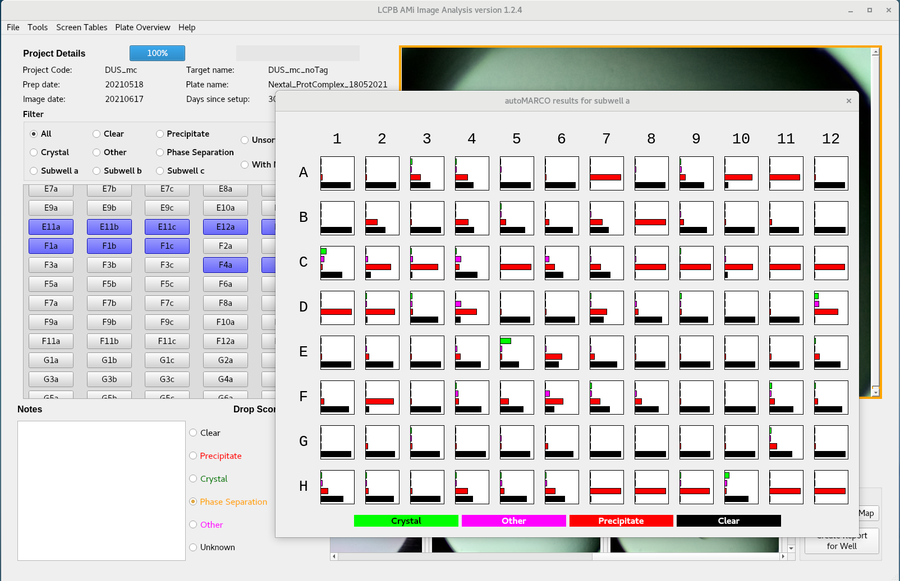

# AMi Image Analysis: Automated Microscope Image Analysis

This is a Python 3 / PyQt5 project dedicated to the analysis of the images generated by the AMi microscope.
The AMi microscope is a low-cost automated microscope.

For more details on this device, please look at:
"AMi: a GUI-based, open-source system for imaging samples in multi-well plates" [[1]](#1)


## Features:

I created this application to help the members of our laboratory in their crystallization work.
The software can read tiff, jpeg or png files.
Images are accessed via clicking on the corresponding well button or by navigating with keyboard shortcuts.
Images can be zoomed for thorough inspection and a timeline of the corresponding well is displayed if several pictures of the same well taken at different times are available.

Images are scored using the Drop Score section.
Notes can be taken and are saved to file.

A report of the current well can be saved as a pdf.

The results can be displayed on a grid and statistics are also calculated.

The tree must be organized like:

```bash
.
└── images
    └── sample directory (used as Project Code)
        └── plate directory (used as Plate name)
            └── YYYYMMDD_HHMMSS
                ├── stacked images (generated from directory rawimages)
                └── rawimages
                    └── files at different focus height
            ├── YYYYMMDD_HHMMSS
            ├── ...
            └── prep_date.txt
```
AMi controlling software needs a folder named "images".
The date directory must have the format YYYYMMDD_HHMMSS (eg. 20191211_151023)
The file "prep_date.txt" only contains the preparation date of the plate. It contains a single line with a date without specific format. It is used for logging purpose only.


2019/12/12:
Automated annotation using TensorFlow (https://www.tensorflow.org/) and MARCO (https://marco.ccr.buffalo.edu/) has been added.
For now, this requires TensorFlow version previous to v2.

Important Note: a threshold is applied to accept or not autoMARCO most probable prediction. If the prediction probability is below
this threshold (currently 0.6 and can be modified in preferences.py), the drop classification is set to "Unknown". 

2019/12/13:
Added visualisation of autoMARCO results

2019/12/17:
Added a tool to automatically crop images using opencv (autocrop.py). This enhances autoMARCO results.
Added a tool to check circle detection on a given image (Check_Circle_detection.py).

2020/01/10:
Parameters controlling circle detection are set in preferences.py
The color of the field indicating the actual classification changes dynamically.
New release.

2020/01/16:
Changed startup routine to include python virtual environment initialisation.
New release.

## Screenshots





## Install

    The software was tested on:
    * linux CentOS 7 (PyQt5 (v5.9.2 and v5.12.1) and python3 (v3.6.8 and v3.7.3))
    * Raspbian 10 (on a Pi 3B+, not recommended)
    * macOS HighSierra

    Hopefully, it should work on other linux distributions, MacOS and Windows.
    You will need a screen with minimum resolution of **1920*1080**.
    
    It is recommended to create a virtual environment for python (see INSTALL.md)

    Download the latest released version and gunzip it or clone this repository with
    git clone https://github.com/LP-CDF/AMi_Image_Analysis AMi_Image_Analysis.
    Then follow the instructions in INSTALL.md

    Dependencies:
    * PyQt5 (v5.9.2 or higher)
    * Python Imaging Library (Pillow, v6.2.1 or higher)
    * PyFPDF (v1.7.2 or higher)

    Optional dependencies:
    * TensorFlow (v1.14 or 1.15, not v2)
    * MARCO tensorflow model (https://storage.googleapis.com/marco-168219-model/savedmodel.zip)
      One version of this model is included in saved_model/
      Methodology details are published in [[2]](#2)
    * openCV for the automatic cropping tool (tested with opencv 4.0.1)
    * NumPy

    Note: a pip requirement file is available for easy install of dependencies.

    Known issues: 
    * On Raspbian AutoMARCO does not work due to a problem with tensorflow.
    * If your graphics card is CUDA capable but with Cuda capability < 6, you must install tensorflow 1.14.0

## Citation

If you wish to cite this work, you can use the following reference:
To be added


## Acknowledgements

This project would not have been possible without the previous work of Dakota Handzlik published in [[3]](#3).
Corresponding project can be found at:
https://github.com/dakota0064/Fluorescent_Robotic_Imager


## References

<a id="1">[1]</a> 
"AMi: a GUI-based, open-source system for imaging samples in multi-well plates"
Andrew Bohm, Acta Crystallogr F Struct Biol Commun. 2019 Aug 1; 75(Pt 8): 531–536.
[doi: 10.1107/S2053230X19009853](http://dx.doi.org/10.1107/S2053230X19009853)

<a id="2">[2]</a> 
"Classification of crystallization outcomes using deep convolutional neural networks."
Bruno AE et al. PLoS One. 2018 Jun 20;13(6):e0198883.
[doi: 10.1371/journal.pone.0198883](http://dx.doi.org/10.1371/journal.pone.0198883)

<a id="3">[3]</a> 
"Inexpensive robotic system for standard and fluorescent imaging of protein crystals."
Handzlik D et al. Acta Crystallogr F Struct Biol Commun. 2019 Nov 1;75(Pt 11):673-686.
[doi: 10.1107/S2053230X19014730](http://dx.doi.org/10.1107/S2053230X19014730)


