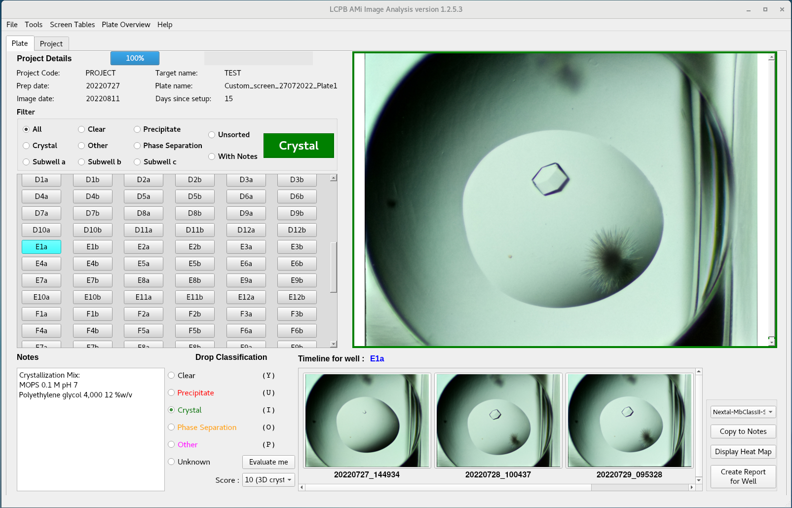

# AMi Image Analysis: Automated Microscope Image Analysis

This is a Python 3 / PyQt5 project dedicated to the analysis of the images generated by the AMi microscope, a low-cost automated microscope.

For more details on this device, please look at:
"AMi: a GUI-based, open-source system for imaging samples in multi-well plates" [[1]](#1)

This program works with images taken by other machines or manual microscopes given the folder hierarchy is respected (see below).


## Features:

I created this application to help the members of our laboratory in their crystallization work.
The software can read tiff, jpeg or png files.
Images are accessed via clicking on the corresponding well button or by navigating with keyboard shortcuts.
Images can be zoomed for thorough inspection.
A timeline is available if the plate has already been imaged.
Screen composition can be loaded from included screens or imported from files following the RockMaker XML format.

Images are scored using the Drop Score section and more details can be written in notes and saved to file.
In addition, a manual score can be assigned if needed.
The results can be displayed on a grid for quick overall inspection and statistics are calculated.
A report of the current well can be saved as a pdf.

The tree must be organized like this:

```bash
.
└── images
    └── sample directory (used as Project and Target Code)
        └── plate directory (used as Plate name)
            └── YYYYMMDD_HHMMSS
                ├── stacked images (generated from directory containing individual Z focus images: e.g: "rawimages")
                └── rawimages (or else)
                    └── files at different focus height (name e.g. A1a_1.jpg, A1a_2... or A1_1.jpg, A1_2... if no subwell)
            ├── YYYYMMDD_HHMMSS
            ├── ...
            └── prep_date.txt
```
or (default from 2021/03/05) 
```bash
.
└── images
    └── Project directory (used as Project Code)
        └── sample directory (used as Target Code)
            └── plate directory (used as Plate name)
		└── YYYYMMDD_HHMMSS
		    ├── stacked images (generated from directory containing individual Z focus images: e.g: "rawimages")
		    └── rawimages (or else)
		        └── files at different focus height (name e.g. A1a_1.jpg, A1a_2... or A1_1.jpg, A1_2... if no subwell)
		├── YYYYMMDD_HHMMSS
		├── ...
		└── prep_date.txt
```
The Tree format is defined during setup (see INSTALL notes).
The folder "images" is used by the software controlling the AMi microscope (AMiGUI.py) but is not needed by AMi_Image_Analysis. 
The date directory must have the format **YYYYMMDD_HHMMSS** (eg. 20191211_151023)
The file "prep_date.txt" is created within the program and contains the preparation date as a single line with format **YYYYMMDD**.


## Screenshots




## Install

The software was tested on:
* linux CentOS 7 and python3 (v3.6.8 and v3.7.3))
* macOS HighSierra/Catalina/Big Sur/Monterey (up to python 3.7.13)

Hopefully, it should work on other linux distributions, MacOS and Windows.
You will need a screen with minimum resolution of **1920*1080**.
    
It is recommended to create a virtual environment for python (see INSTALL.txt)

Download the latest released version and decompress it or clone this repository with
git clone https://github.com/LP-CDF/AMi_Image_Analysis AMi_Image_Analysis.
A dockerfile is also included if you want to install as a Docker container.
Then follow the instructions in INSTALL.txt

Dependencies:
* Python 3 (python below 3.8 if you want to use TensorFlow 1.1x)
* PyQt5
* Python Imaging Library (Pillow, v6.2.1 or higher)
* PyFPDF (v1.7.2 or higher)
* openCV for merging and cropping tools
* NumPy
* Pandas
* Matplotlib

Optional dependencies:
* TensorFlow (v1.1x, not v2)
* MARCO tensorflow model (https://storage.googleapis.com/marco-168219-model/savedmodel.zip)
A copy of this model is included in saved_model/
Methodology details are published in [[2]](#2)

Known issues: 
* On Raspbian AutoMARCO does not work with regular PyPi tensorflow package (see INSTALL.txt).
* If your CPU does not support AVX instruction sets (CPU before SandyBridge), you will need to find a tensorflow with the correct building options (have a look [here](https://github.com/yaroslavvb/tensorflow-community-wheels/issues))


## Citation

If you wish to cite this work, you can use the following reference:
To be added


## Acknowledgements

This project would not have been possible without the previous work of Dakota Handzlik published in [[3]](#3).
Corresponding project can be found at:
https://github.com/dakota0064/Fluorescent_Robotic_Imager

All the Python, Qt communities for sharing experience.


## References

<a id="1">[1]</a> 
"AMi: a GUI-based, open-source system for imaging samples in multi-well plates"
Andrew Bohm, Acta Crystallogr F Struct Biol Commun. 2019 Aug 1; 75(Pt 8): 531–536.
[doi: 10.1107/S2053230X19009853](http://dx.doi.org/10.1107/S2053230X19009853)

<a id="2">[2]</a> 
"Classification of crystallization outcomes using deep convolutional neural networks."
Bruno AE et al. PLoS One. 2018 Jun 20;13(6):e0198883.
[doi: 10.1371/journal.pone.0198883](http://dx.doi.org/10.1371/journal.pone.0198883)

<a id="3">[3]</a> 
"Inexpensive robotic system for standard and fluorescent imaging of protein crystals."
Handzlik D et al. Acta Crystallogr F Struct Biol Commun. 2019 Nov 1;75(Pt 11):673-686.
[doi: 10.1107/S2053230X19014730](http://dx.doi.org/10.1107/S2053230X19014730)


