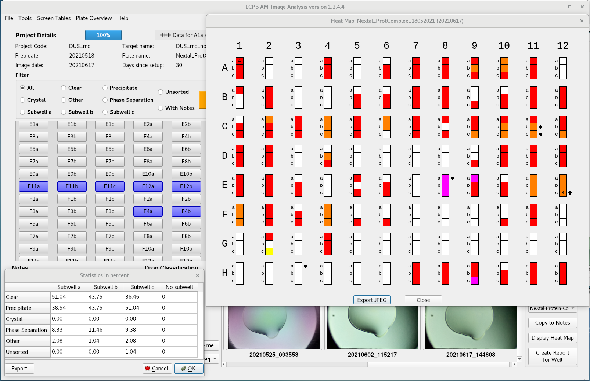

# AMi Image Analysis: Automated Microscope Image Analysis

This is a Python 3 / PyQt5 project dedicated to the analysis of the images generated by the AMi microscope.
The AMi microscope is a low-cost automated microscope.

For more details on this device, please look at:
"AMi: a GUI-based, open-source system for imaging samples in multi-well plates" [[1]](#1)

## Features:

I created this application to help the members of our laboratory in their crystallization work.
The software can read tiff or jpeg files.
Images are accessed via clicking on the corresponding well button or by navigating with keyboard shortcuts.
Images can be zoomed for thorough inspection and a timeline of the corresponding well is displayed if several pictures of the same well taken at different times are available.

Images are scored using the Drop Score section.
Notes can be taken and are saved to file.

A report of the current well can be saved as a pdf.

The results can be displayed on a grid and statistics are also calculated.

2019/12/12:
Automated annotation using TensorFlow (https://www.tensorflow.org/) and MARCO (https://marco.ccr.buffalo.edu/) has been added.
For now, this requires TensorFlow version previous to v2.

2019/12/13:
Added visualisation of autoMARCO results

## Screenshots

## Install

    The software was tested on:
    * linux CentOS 7 (PyQt5 (v5.9.2 and v5.12.1) and python3 (v3.6.8 and v3.7.3))
    * Raspbian 10
    * macOS HighSierra

    Hopefully, it should work on other MacOS and Windows.
    You will need a screen with minimum resolution of 1920*1080.

    Download the latest released version and gunzip it or clone this repository with
    git clone https://github.com/LP-CDF/AMi_Image_Analysis AMi_Image_Analysis

    If on linux or OSX, link the correct Shortcuts_XXX.py version to Shortcuts.py
    If on Windows, copy the correct Shortcuts_XXX.py version to Shortcuts.py

    Dependancies:
    * PyQt5 (v5.9.2 or higher)
    * Python Imaging Library (Pillow, v6.2.1 or higher)
    * PyFPDF (v1.7.2 or higher)

    Optional dependancies:
    * TensorFlow (v1.1x, not v2, tested with version 1.14)
    * MARCO tensorflow model (https://storage.googleapis.com/marco-168219-model/savedmodel.zip)
      One version of this model is included in saved_model/
      Methodology details are published in [[2]](#2)

    Known issues: 
    * On Raspbian, you must ensure that package qt5-image-formats-plugins is installed
    * On Raspbian, buttons do not change color when clicked.

    To start the program type in a terminal:
    python3 AMi_Image_Analysis.py
    or
    ./AMi_Image_Analysis.py (if python3 is in the path)

## Citation

If you wish to cite this work, you can use the following reference:
To be added

## Acknowledgements

This project would not have been possible without the previous work of Dakota Handzlik published in [[3]](#3).
Corresponding project can be found at:
https://github.com/dakota0064/Fluorescent_Robotic_Imager

## References

<a id="1">[1]</a> 
"AMi: a GUI-based, open-source system for imaging samples in multi-well plates"
Andrew Bohm, Acta Crystallogr F Struct Biol Commun. 2019 Aug 1; 75(Pt 8): 531–536.
doi: 10.1107/S2053230X19009853

<a id="2">[2]</a> 
"Classification of crystallization outcomes using deep convolutional neural networks."
Bruno AE et al. PLoS One. 2018 Jun 20;13(6):e0198883.
doi: 10.1371/journal.pone.0198883.

<a id="3">[3]</a> 
"Inexpensive robotic system for standard and fluorescent imaging of protein crystals."
Handzlik D et al. Acta Crystallogr F Struct Biol Commun. 2019 Nov 1;75(Pt 11):673-686.
doi: 10.1107/S2053230X19014730

